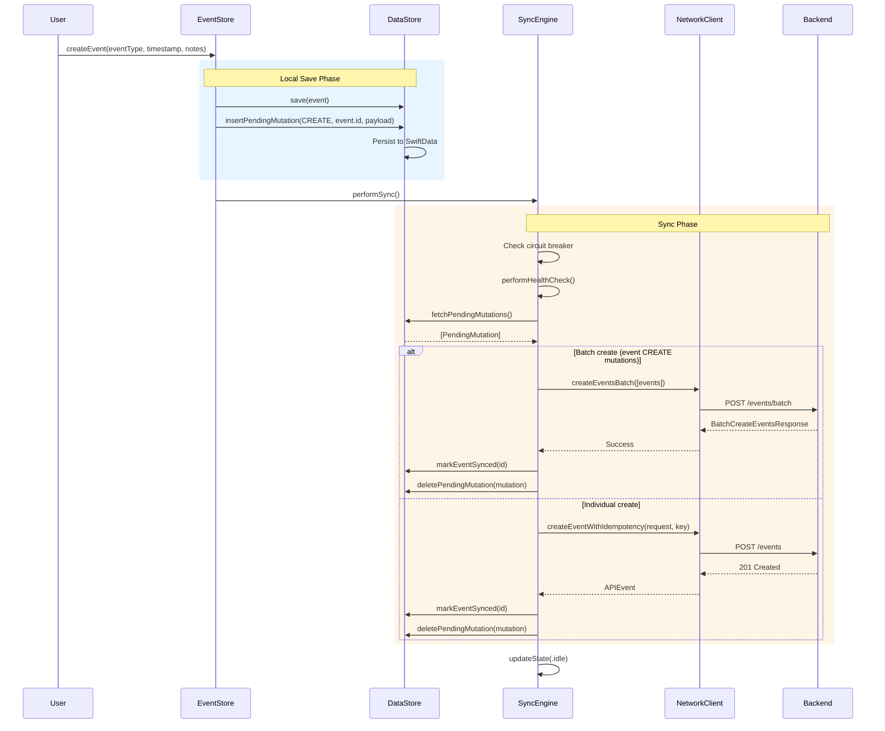
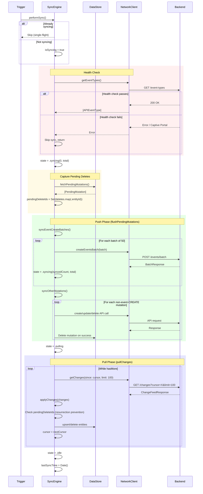
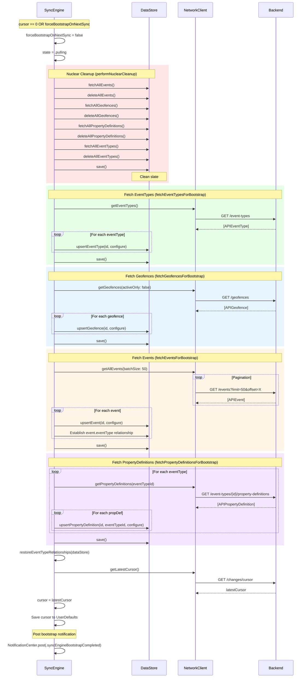
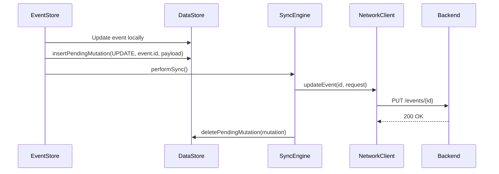
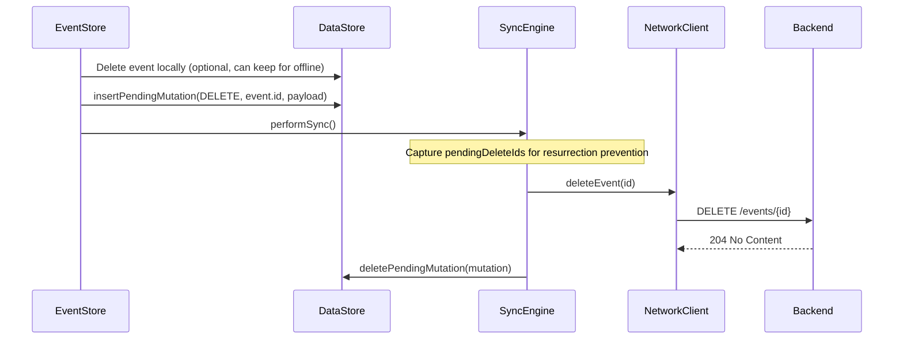

# Data Flows

This document describes the data flows in the SyncEngine for key operations: creating events, running sync cycles, and performing bootstrap fetches.

## Overview

The SyncEngine coordinates data flow between:
- **EventStore**: User-facing data operations
- **DataStore**: Local SwiftData persistence
- **NetworkClient**: Backend API communication
- **Backend**: Go API server with Supabase

**Source:** `apps/ios/trendy/Services/Sync/SyncEngine.swift`

## Create Event Flow

When a user creates an event, it is saved locally and queued for sync.



### Key Points

- Events are saved locally **immediately** (optimistic UI)
- A `PendingMutation` with operation `CREATE` is queued
- `performSync()` can be triggered immediately or batched
- Batch API is used for event CREATEs (50 per batch)
- Idempotency keys prevent duplicate creation on retry

## Sync Cycle Flow (performSync)

The main synchronization cycle consists of three phases: health check, push, and pull.



### Resurrection Prevention

Before applying CREATE/UPDATE changes from the backend, the SyncEngine checks if the entity has a pending DELETE:

```swift
if pendingDeleteIds.contains(change.entityId) {
    Log.sync.debug("Skipping resurrection of pending-delete entity")
    return
}
```

This prevents a race condition where:
1. User deletes an event locally
2. Backend's change feed still has the CREATE entry
3. Without check, the event would be re-created

## Bootstrap Fetch Flow

When the cursor is 0 (first sync) or `forceBootstrapOnNextSync` is true, a full data fetch is performed.



### Refactored Methods (Phase 21)

The bootstrap flow was refactored in Phase 21 to improve maintainability:

| Method | Lines | Purpose |
|--------|-------|---------|
| `performNuclearCleanup` | 39 | Delete all local data |
| `fetchEventTypesForBootstrap` | 32 | Fetch and upsert event types |
| `fetchGeofencesForBootstrap` | 35 | Fetch and upsert geofences |
| `fetchEventsForBootstrap` | 61 | Fetch events with pagination |
| `fetchPropertyDefinitionsForBootstrap` | 56 | Fetch property definitions per type |

### Bootstrap Completion Notification

After bootstrap, a notification is posted so HealthKitService can reload its processed sample IDs:

```swift
await MainActor.run {
    NotificationCenter.default.post(name: .syncEngineBootstrapCompleted, object: nil)
}
```

This prevents duplicate event creation when HealthKit observer queries fire after bootstrap.

## Update and Delete Flows

Updates and deletes follow a similar pattern to creates.

### Update Flow



### Delete Flow



## Related Documentation

- [Sync State Machine](./sync-state-machine.md) - State diagram and transitions
- [Error Recovery Flows](./error-recovery.md) - Error handling and circuit breaker
- [DI Architecture](./di-architecture.md) - Protocol relationships for testing
