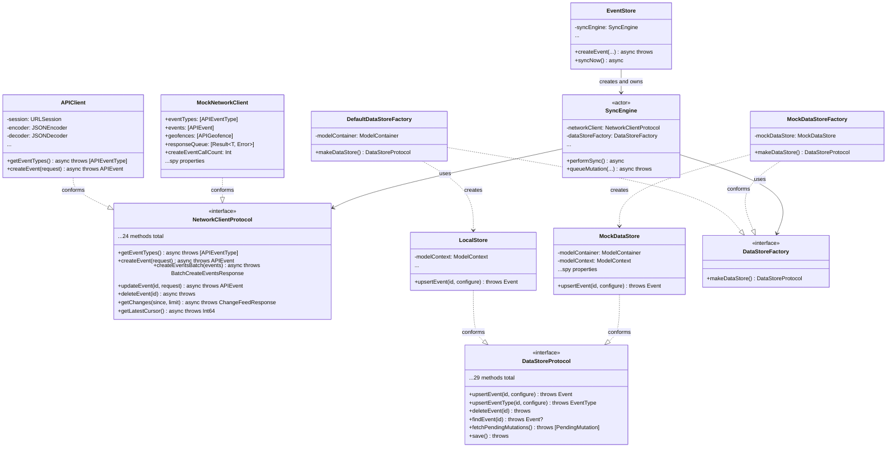

# Dependency Injection Architecture

This document describes the dependency injection (DI) architecture used by the SyncEngine. The DI pattern enables unit testing by allowing mock implementations to be injected.

## Overview

The SyncEngine depends on two protocols:
- **NetworkClientProtocol**: For backend API communication
- **DataStoreFactory**: For creating DataStore instances

This design enables:
- Unit testing without network or database access
- Clear separation of concerns
- Actor-safe dependency management

**Source Files:**
- `apps/ios/trendy/Protocols/NetworkClientProtocol.swift`
- `apps/ios/trendy/Protocols/DataStoreProtocol.swift`

## Class Diagram



## Protocol Descriptions

### NetworkClientProtocol

**Sendable:** Yes - crosses actor boundaries safely.

Abstracts all backend API communication. Contains 24 methods covering:
- Event operations (CRUD + batch)
- EventType operations (CRUD)
- Geofence operations (CRUD)
- PropertyDefinition operations (CRUD)
- Change feed operations

```swift
protocol NetworkClientProtocol: Sendable {
    // Event Type Operations
    func getEventTypes() async throws -> [APIEventType]
    func createEventType(_ request: CreateEventTypeRequest) async throws -> APIEventType
    func createEventTypeWithIdempotency(_ request: CreateEventTypeRequest, idempotencyKey: String) async throws -> APIEventType
    func updateEventType(id: String, _ request: UpdateEventTypeRequest) async throws -> APIEventType
    func deleteEventType(id: String) async throws

    // Event Operations
    func getEvents(limit: Int, offset: Int) async throws -> [APIEvent]
    func getAllEvents(batchSize: Int) async throws -> [APIEvent]
    func createEvent(_ request: CreateEventRequest) async throws -> APIEvent
    func createEventWithIdempotency(_ request: CreateEventRequest, idempotencyKey: String) async throws -> APIEvent
    func createEventsBatch(_ events: [CreateEventRequest]) async throws -> BatchCreateEventsResponse
    func updateEvent(id: String, _ request: UpdateEventRequest) async throws -> APIEvent
    func deleteEvent(id: String) async throws

    // Geofence Operations
    func getGeofences(activeOnly: Bool) async throws -> [APIGeofence]
    func createGeofence(_ request: CreateGeofenceRequest) async throws -> APIGeofence
    func createGeofenceWithIdempotency(_ request: CreateGeofenceRequest, idempotencyKey: String) async throws -> APIGeofence
    func updateGeofence(id: String, _ request: UpdateGeofenceRequest) async throws -> APIGeofence
    func deleteGeofence(id: String) async throws

    // Property Definition Operations
    func getPropertyDefinitions(eventTypeId: String) async throws -> [APIPropertyDefinition]
    func createPropertyDefinition(eventTypeId: String, _ request: CreatePropertyDefinitionRequest) async throws -> APIPropertyDefinition
    func createPropertyDefinitionWithIdempotency(_ request: CreatePropertyDefinitionRequest, idempotencyKey: String) async throws -> APIPropertyDefinition
    func updatePropertyDefinition(id: String, _ request: UpdatePropertyDefinitionRequest) async throws -> APIPropertyDefinition
    func deletePropertyDefinition(id: String) async throws

    // Change Feed Operations
    func getChanges(since cursor: Int64, limit: Int) async throws -> ChangeFeedResponse
    func getLatestCursor() async throws -> Int64
}
```

### DataStoreProtocol

**Sendable:** No - uses ModelContext which is not thread-safe.

Abstracts all local persistence operations. Contains 29 methods covering:
- Upsert operations (4 entity types)
- Delete operations (individual + bulk)
- Find operations (4 entity types)
- Fetch all operations (4 entity types)
- Pending mutation operations
- Sync status updates

```swift
protocol DataStoreProtocol {
    // Upsert Operations
    @discardableResult
    func upsertEvent(id: String, configure: (Event) -> Void) throws -> Event
    @discardableResult
    func upsertEventType(id: String, configure: (EventType) -> Void) throws -> EventType
    @discardableResult
    func upsertGeofence(id: String, configure: (Geofence) -> Void) throws -> Geofence
    @discardableResult
    func upsertPropertyDefinition(id: String, eventTypeId: String, configure: (PropertyDefinition) -> Void) throws -> PropertyDefinition

    // Delete Operations
    func deleteEvent(id: String) throws
    func deleteEventType(id: String) throws
    func deleteGeofence(id: String) throws
    func deletePropertyDefinition(id: String) throws

    // Bulk Delete Operations
    func deleteAllEvents() throws
    func deleteAllEventTypes() throws
    func deleteAllGeofences() throws
    func deleteAllPropertyDefinitions() throws

    // Find Operations
    func findEvent(id: String) throws -> Event?
    func findEventType(id: String) throws -> EventType?
    func findGeofence(id: String) throws -> Geofence?
    func findPropertyDefinition(id: String) throws -> PropertyDefinition?

    // Fetch All Operations
    func fetchAllEvents() throws -> [Event]
    func fetchAllEventTypes() throws -> [EventType]
    func fetchAllGeofences() throws -> [Geofence]
    func fetchAllPropertyDefinitions() throws -> [PropertyDefinition]

    // Pending Mutation Operations
    func fetchPendingMutations() throws -> [PendingMutation]
    func hasPendingMutation(entityId: String, entityType: MutationEntityType, operation: MutationOperation) throws -> Bool
    func insertPendingMutation(_ mutation: PendingMutation) throws
    func deletePendingMutation(_ mutation: PendingMutation) throws

    // Sync Status Updates
    func markEventSynced(id: String) throws
    func markEventTypeSynced(id: String) throws
    func markGeofenceSynced(id: String) throws
    func markPropertyDefinitionSynced(id: String) throws

    // Persistence
    func save() throws
}
```

### DataStoreFactory

**Sendable:** Yes - passed into actor, creates DataStore inside.

Factory pattern that creates DataStore instances. This solves the ModelContext threading problem.

```swift
protocol DataStoreFactory: Sendable {
    func makeDataStore() -> any DataStoreProtocol
}
```

## Factory Pattern Explanation

### The Problem

ModelContext (SwiftData) is not Sendable and not thread-safe:

```swift
// This CANNOT work:
actor SyncEngine {
    let dataStore: DataStoreProtocol  // ModelContext inside - not Sendable!
}
```

The actor requires all stored properties to be Sendable for safe access across isolation boundaries.

### The Solution

Use a factory that IS Sendable, and create DataStore instances inside the actor:

```swift
// This WORKS:
actor SyncEngine {
    let dataStoreFactory: DataStoreFactory  // Sendable!

    func doWork() {
        let dataStore = dataStoreFactory.makeDataStore()  // Created inside actor
        // Use dataStore...
    }
}
```

### Implementation

```swift
final class DefaultDataStoreFactory: DataStoreFactory, Sendable {
    private let modelContainer: ModelContainer  // Sendable

    init(modelContainer: ModelContainer) {
        self.modelContainer = modelContainer
    }

    func makeDataStore() -> any DataStoreProtocol {
        let context = ModelContext(modelContainer)  // New context each time
        return LocalStore(modelContext: context)
    }
}
```

Each call to `makeDataStore()` creates a fresh ModelContext, ensuring:
- Thread safety (each context is used on one thread)
- Data freshness (new context sees latest changes)

## Sendable Considerations

| Type | Sendable | Reason |
|------|----------|--------|
| `NetworkClientProtocol` | Yes | Crosses actor boundary when passed to SyncEngine |
| `APIClient` | Yes (`@unchecked`) | URLSession is thread-safe; encoder/decoder accessed serially |
| `DataStoreProtocol` | No | ModelContext is not thread-safe |
| `DataStoreFactory` | Yes | Passed into actor from outside |
| `LocalStore` | No | Contains ModelContext |
| `MockDataStore` | No | Contains ModelContext |

### APIClient @unchecked Sendable

APIClient uses `@unchecked Sendable` because:
1. URLSession is thread-safe
2. JSONEncoder/JSONDecoder are accessed via async serialization
3. Manual verification confirms safety

```swift
final class APIClient: NetworkClientProtocol, @unchecked Sendable {
    private let session: URLSession
    private let encoder: JSONEncoder
    private let decoder: JSONDecoder
    // ...
}
```

## Testing Architecture

### MockNetworkClient

Spy pattern with configurable responses:

```swift
final class MockNetworkClient: NetworkClientProtocol {
    // Configurable data
    var eventTypes: [APIEventType] = []
    var events: [APIEvent] = []
    var geofences: [APIGeofence] = []

    // Response queue for sequential responses
    var responseQueue: [Result<Any, Error>] = []

    // Spy counters
    var createEventCallCount = 0
    var getChangesCallCount = 0

    // Captured arguments
    var lastCreateEventRequest: CreateEventRequest?
    var lastIdempotencyKey: String?
}
```

### MockDataStore

In-memory ModelContainer for SwiftData models:

```swift
final class MockDataStore: DataStoreProtocol {
    private let modelContainer: ModelContainer
    private let modelContext: ModelContext

    init() {
        let config = ModelConfiguration(isStoredInMemoryOnly: true)
        modelContainer = try! ModelContainer(
            for: Event.self, EventType.self, Geofence.self, PropertyDefinition.self, PendingMutation.self,
            configurations: config
        )
        modelContext = ModelContext(modelContainer)
    }

    // Spy properties
    var upsertEventCallCount = 0
    var deleteEventCallCount = 0
    // ...
}
```

### Test Setup Pattern

```swift
func makeTestDependencies() -> (MockNetworkClient, MockDataStoreFactory) {
    let mockNetworkClient = MockNetworkClient()
    let mockDataStoreFactory = MockDataStoreFactory()

    return (mockNetworkClient, mockDataStoreFactory)
}

func testSyncBehavior() async throws {
    let (mockNetwork, mockFactory) = makeTestDependencies()
    let syncEngine = SyncEngine(
        networkClient: mockNetwork,
        dataStoreFactory: mockFactory
    )

    // Configure mock responses
    mockNetwork.eventTypes = [APIEventType(id: "1", name: "Test", ...)]

    // Execute
    await syncEngine.performSync()

    // Assert
    XCTAssertEqual(mockNetwork.getEventTypesCallCount, 1)
}
```

## Design Decisions

### Protocol over Framework

We chose protocol-based DI over third-party frameworks because:
1. **Actor-safe**: Protocols with Sendable constraints work with Swift's actor model
2. **No dependencies**: No external framework to maintain
3. **Type-safe**: Swift's type system enforces correct usage
4. **Testable**: Easy to create mock implementations

### Fresh DataStore per Operation

Each operation creates a new DataStore:

```swift
func performSync() async {
    let dataStore = dataStoreFactory.makeDataStore()
    // Use dataStore for this sync cycle...
}
```

Benefits:
- Thread safety guaranteed
- No stale data issues
- Clear ownership semantics

### NetworkClientProtocol Requires Sendable

The protocol requires Sendable conformance because:
1. SyncEngine is an actor
2. NetworkClient is passed in during init (crosses isolation boundary)
3. Swift 6 strict concurrency checking requires this

## Related Documentation

- [Sync State Machine](./sync-state-machine.md) - State diagram and transitions
- [Error Recovery Flows](./error-recovery.md) - Error handling and circuit breaker
- [Data Flows](./data-flows.md) - Sequence diagrams for operations
