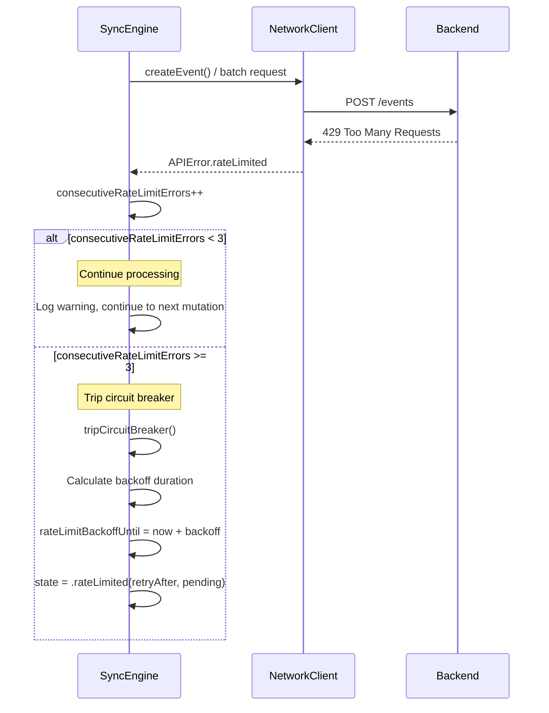
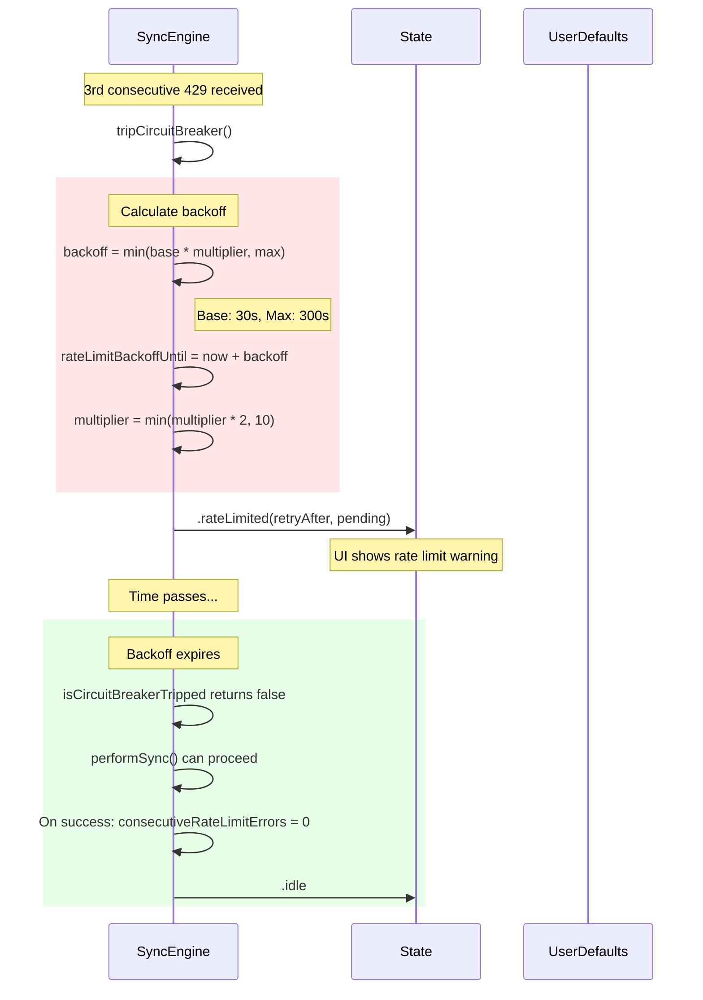
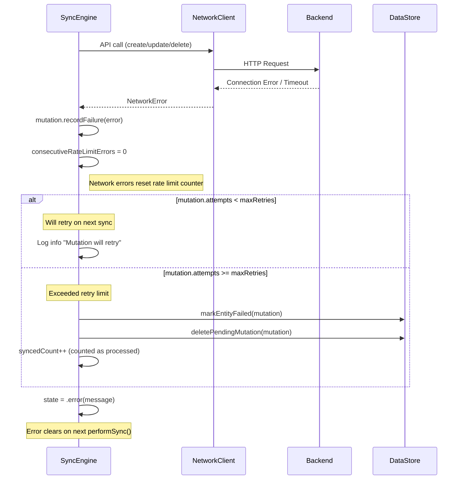
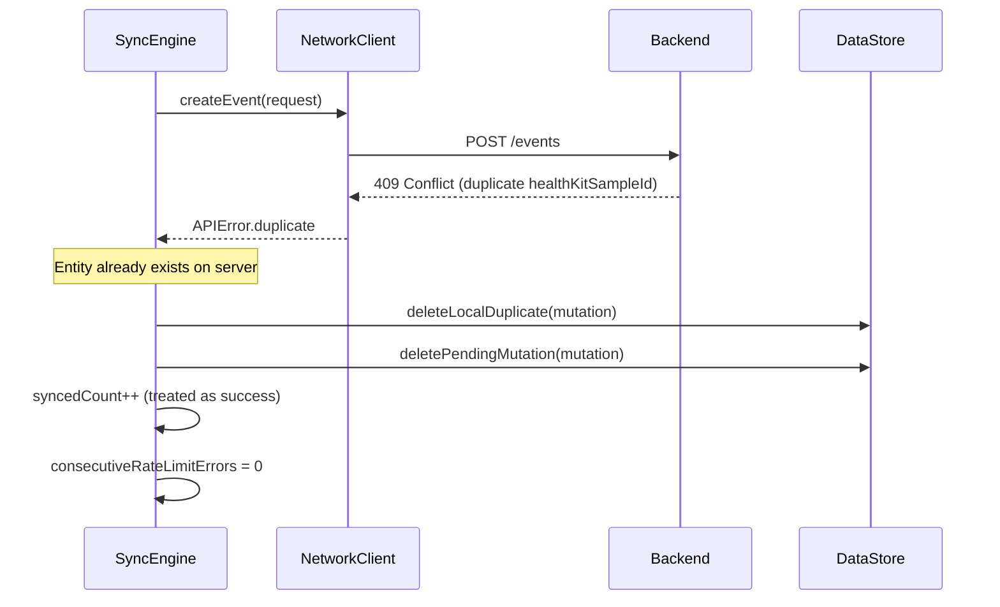

# Error Recovery Flows

This document describes how the SyncEngine handles errors during synchronization. It covers rate limit handling, circuit breaker behavior, and network error recovery.

## Overview

The SyncEngine implements a robust error handling strategy with three key mechanisms:

1. **Rate Limit Tracking**: Counts consecutive 429 errors
2. **Circuit Breaker**: Stops sync after threshold exceeded
3. **Exponential Backoff**: Progressive delay between retries

**Source:** `apps/ios/trendy/Services/Sync/SyncEngine.swift`

## Rate Limit Handling

When the backend returns a 429 (Too Many Requests) response, the SyncEngine tracks consecutive occurrences to detect sustained rate limiting.



### Key Code Reference

```swift
// From syncOtherMutations() and syncEventCreateBatches()
} catch let error as APIError where error.isRateLimitError {
    consecutiveRateLimitErrors += 1
    Log.sync.warning("Rate limit error during mutation flush", context: .with { ctx in
        ctx.add("consecutive_rate_limits", consecutiveRateLimitErrors)
    })
    // Don't increment mutation.attempts for rate limits
    // Will retry on next sync cycle after backoff
}
```

## Circuit Breaker Behavior

The circuit breaker prevents overwhelming the backend during sustained rate limiting. It uses exponential backoff to progressively delay retries.



### Backoff Schedule

| Trip # | Multiplier | Backoff Duration |
|--------|------------|------------------|
| 1 | 1.0 | 30 seconds |
| 2 | 2.0 | 60 seconds |
| 3 | 4.0 | 120 seconds |
| 4 | 8.0 | 240 seconds |
| 5+ | 10.0 | 300 seconds (max) |

### Circuit Breaker Properties

```swift
/// Check if the circuit breaker is currently tripped
var isCircuitBreakerTripped: Bool {
    if let backoffUntil = rateLimitBackoffUntil {
        return Date() < backoffUntil
    }
    return false
}

/// Get remaining backoff time in seconds
var circuitBreakerBackoffRemaining: TimeInterval {
    if let backoffUntil = rateLimitBackoffUntil {
        return max(0, backoffUntil.timeIntervalSinceNow)
    }
    return 0
}
```

### Manual Reset

Users can manually reset the circuit breaker to retry immediately:

```swift
func resetCircuitBreaker() async {
    Log.sync.info("Circuit breaker manually reset by user")
    consecutiveRateLimitErrors = 0
    rateLimitBackoffUntil = nil
    rateLimitBackoffMultiplier = 1.0
    await updateState(.idle)
}
```

## Network Error Recovery

Network errors (connection failures, timeouts) are handled differently from rate limits. They count against the mutation's retry limit.



### Retry Limit Behavior

Each mutation tracks its own retry attempts:

```swift
// PendingMutation has:
mutation.recordFailure(error: String)  // Increments attempts
mutation.hasExceededRetryLimit        // Returns true if attempts >= maxRetries
```

When a mutation exceeds its retry limit:
1. The corresponding entity is marked with `syncStatus = .failed`
2. The mutation is deleted from the queue
3. The entity remains in local storage for user review

## Error Type Summary

| Error Type | Rate Limit Counter | Mutation Retry Counter | Behavior |
|------------|-------------------|------------------------|----------|
| 429 Rate Limit | Incremented | NOT incremented | Retry after backoff |
| Duplicate (409) | Reset to 0 | N/A | Delete local duplicate |
| Network Error | Reset to 0 | Incremented | Retry with backoff |
| Timeout | Reset to 0 | Incremented | Retry with backoff |
| Other API Error | Reset to 0 | Incremented | Retry with backoff |

## Duplicate Error Handling

When the backend detects a duplicate (same unique constraint):



This handles race conditions where multiple code paths (HealthKit observer, manual sync) try to create the same event.

## Clearing Stuck Mutations

If mutations are continuously failing, users can clear the queue:

```swift
@discardableResult
func clearPendingMutations(markEntitiesFailed: Bool = true) async -> Int {
    // Deletes all pending mutations
    // Optionally marks entities as failed
    // Resets circuit breaker state
    // Returns count of cleared mutations
}
```

This is a recovery mechanism for edge cases where mutations are permanently unrecoverable.

## Related Documentation

- [Sync State Machine](./sync-state-machine.md) - State diagram and transitions
- [Data Flows](./data-flows.md) - Sequence diagrams for normal operations
- [DI Architecture](./di-architecture.md) - Protocol relationships for testing
