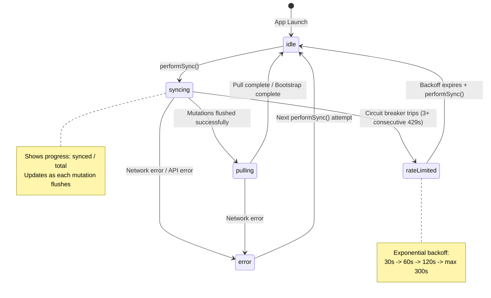

# SyncEngine State Machine

This document describes the state machine that governs the SyncEngine's synchronization behavior. The state machine ensures proper flow control, error handling, and user feedback during sync operations.

## Overview

The SyncEngine uses a `SyncState` enum to track the current synchronization state. This state is observable on the MainActor and drives UI updates (progress indicators, error messages, rate limit warnings).

**Source:** `apps/ios/trendy/Services/Sync/SyncEngine.swift`

## State Diagram



## State Descriptions

| State | Description | Associated Values |
|-------|-------------|-------------------|
| `idle` | No sync in progress. Ready to accept new sync requests. | None |
| `syncing(synced: Int, total: Int)` | Actively pushing local mutations to the backend. Shows progress for UI. | `synced`: count of mutations successfully flushed; `total`: total pending mutations |
| `pulling` | Downloading remote changes from the backend after push completes. Also used during bootstrap fetch. | None |
| `rateLimited(retryAfter: TimeInterval, pending: Int)` | Circuit breaker has tripped after 3+ consecutive 429 errors. Sync is paused. | `retryAfter`: seconds until retry allowed; `pending`: number of mutations still waiting |
| `error(String)` | Sync failed with an error. Will retry on next sync attempt. | Error message describing the failure |

## State Transitions

| From State | To State | Trigger | Description |
|------------|----------|---------|-------------|
| `[*]` | `idle` | App launch | Initial state when SyncEngine is created |
| `idle` | `syncing` | `performSync()` called | Health check passes, sync begins |
| `syncing` | `pulling` | All mutations flushed | Push phase complete, begin pull phase |
| `syncing` | `rateLimited` | Circuit breaker trips | 3+ consecutive 429 errors detected |
| `syncing` | `error` | Network/API error | Non-rate-limit error during flush |
| `pulling` | `idle` | Pull complete | All changes downloaded and applied |
| `pulling` | `error` | Network error | Error during pullChanges or bootstrap |
| `rateLimited` | `idle` | Backoff expires | After waiting `retryAfter` seconds, next sync can proceed |
| `error` | `idle` | `performSync()` called | Error clears on next sync attempt |

## Key Implementation Details

### Single-Flight Pattern

The SyncEngine uses a single-flight pattern to prevent concurrent syncs:

```swift
guard !isSyncing else {
    Log.sync.debug("Sync already in progress, skipping")
    return
}
isSyncing = true
```

Only one sync can run at a time. Concurrent `performSync()` calls are ignored.

### Health Check Gate

Before transitioning from `idle` to `syncing`, a health check verifies actual connectivity:

```swift
guard await performHealthCheck() else {
    Log.sync.info("Skipping sync - health check failed (likely captive portal)")
    return
}
```

This catches captive portal situations where `NWPathMonitor` reports "satisfied" but actual API calls would fail.

### Circuit Breaker Threshold

The circuit breaker trips after 3 consecutive rate limit (429) errors:

```swift
private let rateLimitCircuitBreakerThreshold = 3
```

When tripped, the state transitions to `rateLimited` with exponential backoff.

### Progress Updates

During `syncing`, progress is reported as mutations are processed:

```swift
await updateState(.syncing(synced: syncedCount, total: totalPending))
```

This enables UI to show a progress indicator (e.g., "Syncing 5/12...").

## UI Integration

The state can be observed from SwiftUI views:

```swift
@MainActor public private(set) var state: SyncState = .idle
```

Example usage in a view:

```swift
switch syncEngine.state {
case .idle:
    Image(systemName: "checkmark.circle")
case .syncing(let synced, let total):
    ProgressView(value: Double(synced), total: Double(total))
case .pulling:
    ProgressView()
case .rateLimited(let retryAfter, _):
    Text("Rate limited. Retry in \(Int(retryAfter))s")
case .error(let message):
    Text("Error: \(message)")
}
```

## Related Documentation

- [Error Recovery Flows](./error-recovery.md) - Detailed sequence diagrams for error handling
- [Data Flows](./data-flows.md) - Sequence diagrams for create event, sync cycle, and bootstrap
- [DI Architecture](./di-architecture.md) - Protocol relationships and factory pattern
