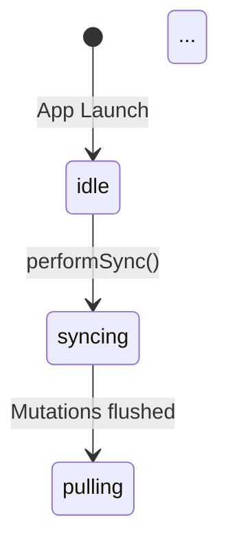

<objective>
Document SyncEngine architecture with Mermaid diagrams for maintainability and onboarding.

Purpose: Provide visual documentation of sync state machine, error recovery flows, data flows, and DI architecture. These diagrams render natively in GitHub and serve as living documentation for the SyncEngine subsystem.

Output:
- sync-state-machine.md: State diagram showing SyncState transitions
- error-recovery.md: Sequence diagrams for error handling and circuit breaker
- data-flows.md: Sequence diagrams for create event, sync cycle, bootstrap
- di-architecture.md: Class diagram showing protocol relationships
</objective>

<execution_context>
@/Users/cipher/.claude/get-shit-done/workflows/execute-plan.md
@/Users/cipher/.claude/get-shit-done/templates/summary.md
</execution_context>

<context>
@.planning/PROJECT.md
@.planning/ROADMAP.md
@.planning/phases/22-metrics-documentation/22-RESEARCH.md
@apps/ios/trendy/Services/Sync/SyncEngine.swift
@apps/ios/trendy/Services/Protocols/NetworkClientProtocol.swift
@apps/ios/trendy/Services/Protocols/DataStoreProtocol.swift
</context>

<tasks>

<task type="auto">
  <name>Task 1: Document sync state machine</name>
  <files>.planning/docs/sync-state-machine.md</files>
  <action>
Create .planning/docs/sync-state-machine.md documenting SyncState transitions:

**Document structure:**
1. Title and overview
2. Mermaid state diagram
3. State descriptions table
4. Transition triggers table

**SyncState enum (from SyncEngine.swift):**
- idle: No sync in progress
- syncing(synced: Int, total: Int): Pushing local changes
- pulling: Downloading remote changes
- rateLimited(retryAfter: TimeInterval, pending: Int): Circuit breaker tripped
- error(String): Sync failed

**State transitions to document:**
- [*] --> idle: App launch
- idle --> syncing: performSync() called
- syncing --> pulling: Mutations flushed successfully
- syncing --> rateLimited: Circuit breaker trips (3 consecutive 429s)
- syncing --> error: Network error
- pulling --> idle: Pull complete, bootstrap complete
- pulling --> error: Network error
- rateLimited --> idle: Backoff expires
- error --> idle: Next sync attempt

**Mermaid syntax:**


Include notes on stateful values (synced/total in syncing, retryAfter/pending in rateLimited).
  </action>
  <verify>File exists at .planning/docs/sync-state-machine.md with stateDiagram-v2, all 5 states documented, transitions table</verify>
  <done>Sync state machine documented with complete state diagram and transition descriptions (DOC-01)</done>
</task>

<task type="auto">
  <name>Task 2: Document error recovery flows</name>
  <files>.planning/docs/error-recovery.md</files>
  <action>
Create .planning/docs/error-recovery.md with sequence diagrams for error handling:

**Document structure:**
1. Title and overview
2. Rate limit handling sequence diagram
3. Circuit breaker behavior sequence diagram
4. Network error recovery sequence diagram
5. Retry pattern details

**Sequence diagram 1: Rate Limit Handling**
Show:
- SyncEngine -> NetworkClient: API call
- NetworkClient -> Backend: Request
- Backend --> NetworkClient: 429 + Retry-After
- NetworkClient --> SyncEngine: RateLimitError
- SyncEngine: Increment consecutiveRateLimitErrors
- alt: < threshold -> Continue with backoff
- alt: >= threshold -> Trip circuit breaker

**Sequence diagram 2: Circuit Breaker Recovery**
Show:
- SyncEngine: circuitBreakerTripped = true
- SyncEngine -> State: .rateLimited(retryAfter, pending)
- Note: Exponential backoff (30s -> 60s -> 120s -> max 300s)
- After backoff: circuitBreakerTripped = false
- SyncEngine: Resume sync

**Sequence diagram 3: Network Error Recovery**
Show:
- SyncEngine -> NetworkClient: API call
- NetworkClient -> Backend: Request
- Backend --> NetworkClient: Connection error
- NetworkClient --> SyncEngine: NetworkError
- SyncEngine -> State: .error(message)
- SyncEngine: Clear error on next performSync()

Include code references to SyncEngine.swift methods where error handling occurs.
  </action>
  <verify>File exists at .planning/docs/error-recovery.md with 3 sequence diagrams (rate limit, circuit breaker, network error)</verify>
  <done>Error recovery flows documented with sequence diagrams showing retry logic and circuit breaker behavior (DOC-02)</done>
</task>

<task type="auto">
  <name>Task 3: Document data flows</name>
  <files>.planning/docs/data-flows.md</files>
  <action>
Create .planning/docs/data-flows.md with sequence diagrams for key operations:

**Document structure:**
1. Title and overview
2. Create Event flow sequence diagram
3. Sync Cycle flow sequence diagram
4. Bootstrap Fetch flow sequence diagram

**Sequence diagram 1: Create Event**
Participants: User, EventStore, SyncEngine, DataStore, NetworkClient, Backend
Show:
- User -> EventStore: createEvent()
- EventStore -> DataStore: save(event)
- EventStore -> DataStore: save(mutation: CREATE)
- EventStore -> SyncEngine: performSync()
- SyncEngine -> DataStore: fetchPendingMutations()
- SyncEngine -> NetworkClient: createEvent()
- NetworkClient -> Backend: POST /events
- Backend --> NetworkClient: 201 Created
- NetworkClient --> SyncEngine: Success
- SyncEngine -> DataStore: delete(mutation)

**Sequence diagram 2: Sync Cycle (performSync)**
Participants: Trigger, SyncEngine, DataStore, NetworkClient, Backend
Show:
- Trigger -> SyncEngine: performSync()
- SyncEngine -> SyncEngine: Check circuit breaker
- SyncEngine -> SyncEngine: performHealthCheck()
- SyncEngine -> DataStore: fetchPendingMutations()
- loop: For each mutation batch
  - SyncEngine -> NetworkClient: flush mutation
  - NetworkClient -> Backend: API call
- SyncEngine -> NetworkClient: pullChanges(cursor)
- NetworkClient -> Backend: GET /changes?cursor=X
- Backend --> NetworkClient: Changes + hasMore
- SyncEngine -> DataStore: Apply changes
- SyncEngine -> SyncEngine: Update cursor

**Sequence diagram 3: Bootstrap Fetch**
Participants: SyncEngine, DataStore, NetworkClient, Backend
Show:
- Note: Triggered when cursor=0 or forceBootstrapOnNextSync
- SyncEngine -> DataStore: Delete all local data (nuclear cleanup)
- SyncEngine -> NetworkClient: getEventTypes()
- NetworkClient -> Backend: GET /event-types
- SyncEngine -> DataStore: save(eventTypes)
- SyncEngine -> NetworkClient: getGeofences()
- SyncEngine -> DataStore: save(geofences)
- SyncEngine -> NetworkClient: getEvents() with pagination
- loop: While hasMore
  - NetworkClient -> Backend: GET /events?cursor=X
  - SyncEngine -> DataStore: save(events)
- SyncEngine -> NetworkClient: getPropertyDefinitions()
- SyncEngine -> DataStore: save(propertyDefinitions)
- SyncEngine -> SyncEngine: Set cursor to latest

Reference the refactored methods from Phase 21: performNuclearCleanup, fetchEventTypesForBootstrap, fetchGeofencesForBootstrap, fetchEventsForBootstrap, fetchPropertyDefinitionsForBootstrap.
  </action>
  <verify>File exists at .planning/docs/data-flows.md with 3 sequence diagrams (create event, sync cycle, bootstrap)</verify>
  <done>Data flow diagrams document create event, sync cycle, and bootstrap paths with all participants (DOC-03)</done>
</task>

<task type="auto">
  <name>Task 4: Document DI architecture</name>
  <files>.planning/docs/di-architecture.md</files>
  <action>
Create .planning/docs/di-architecture.md documenting dependency injection architecture:

**Document structure:**
1. Title and overview
2. Mermaid class diagram showing protocol relationships
3. Protocol descriptions table
4. Factory pattern explanation
5. Sendable considerations

**Class diagram showing:**
- NetworkClientProtocol (interface)
- APIClient implements NetworkClientProtocol
- DataStoreProtocol (interface)
- LocalStore implements DataStoreProtocol
- DataStoreFactory (interface)
- DefaultDataStoreFactory implements DataStoreFactory
- SyncEngine uses NetworkClientProtocol, DataStoreFactory
- EventStore creates SyncEngine

**Mermaid syntax:**
```mermaid
classDiagram
    class NetworkClientProtocol {
        <<interface>>
        +getEvents() async throws [APIEvent]
        +createEvent() async throws APIEvent
        ...
    }

    class APIClient {
        +getEvents() async throws [APIEvent]
        ...
    }

    APIClient ..|> NetworkClientProtocol

    class DataStoreFactory {
        <<interface>>
        +makeDataStore() DataStoreProtocol
    }
    ...
```

**Key points to document:**
1. NetworkClientProtocol: Sendable (crosses actor boundary)
2. DataStoreProtocol: NOT Sendable (used within actor context)
3. DataStoreFactory: Sendable (passed into actor, creates DataStore inside)
4. Why factory pattern: ModelContext is not Sendable, factory defers creation to inside actor
5. MockNetworkClient and MockDataStore for testing
6. Code references to Protocol files in Services/Protocols/

Include the decision rationale from STATE.md accumulated decisions.
  </action>
  <verify>File exists at .planning/docs/di-architecture.md with classDiagram, protocol descriptions, factory pattern explanation</verify>
  <done>DI architecture documented with class diagram and protocol relationships (DOC-04)</done>
</task>

</tasks>

<verification>
1. .planning/docs/sync-state-machine.md exists with stateDiagram-v2
2. .planning/docs/error-recovery.md exists with 3 sequenceDiagram blocks
3. .planning/docs/data-flows.md exists with 3 sequenceDiagram blocks
4. .planning/docs/di-architecture.md exists with classDiagram
5. All Mermaid diagrams render correctly (validate syntax)
</verification>

<success_criteria>
- DOC-01: Sync state machine documented with Mermaid state diagram
- DOC-02: Error recovery flows documented with sequence diagrams
- DOC-03: Data flows documented for create event, sync cycle, bootstrap
- DOC-04: DI architecture documented with class diagram and protocol relationships
</success_criteria>

<output>
After completion, create `.planning/phases/22-metrics-documentation/22-02-SUMMARY.md`
</output>
