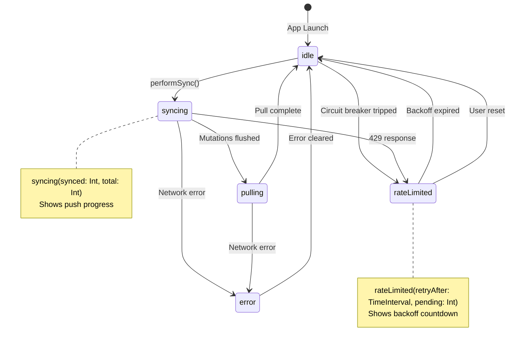
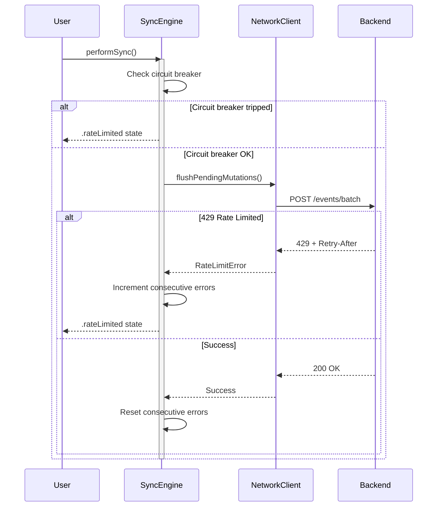

# Phase 22: Metrics & Documentation - Research

**Researched:** 2026-01-24
**Domain:** iOS performance instrumentation (os.signpost, MetricKit), architecture documentation (Mermaid diagrams)
**Confidence:** HIGH

## Summary

This phase covers two distinct but complementary domains: production observability through Apple's native telemetry frameworks, and architecture documentation using Mermaid diagrams in org-mode format.

For metrics, Apple provides a cohesive telemetry stack: `OSSignposter` for development profiling (viewable in Instruments) and `MetricKit` for production telemetry (daily aggregated reports). These integrate seamlessly - `mxSignpost` calls are captured by both systems, enabling consistent instrumentation that works in development and production.

For documentation, Mermaid diagrams provide text-based diagramming that renders in GitHub, org-mode (via ob-mermaid), and most modern documentation tools. State diagrams and sequence diagrams are the key diagram types for documenting sync state machine and error recovery flows.

**Primary recommendation:** Instrument all sync operations with `OSSignposter` intervals, add `mxSignpost` calls for production metrics, create a `MetricsSubscriber` class to receive `MXMetricPayload` daily reports, and document sync architecture with Mermaid state/sequence diagrams.

## Standard Stack

The established libraries/tools for this domain:

### Core - Metrics

| Library | Version | Purpose | Why Standard |
|---------|---------|---------|--------------|
| OSSignposter | iOS 15+ | Development profiling | Modern Swift API, async-friendly, Instruments integration |
| MetricKit | iOS 13+ | Production telemetry | Apple's official production metrics, no third-party dependencies |
| os.Logger | iOS 14+ | Signpost log handles | Already in use (Log.*), provides subsystem/category for OSSignposter |
| mxSignpost | iOS 13+ | Custom metric intervals | Bridges OSSignposter and MetricKit in one API |

### Core - Documentation

| Library | Version | Purpose | Why Standard |
|---------|---------|---------|--------------|
| Mermaid | 11.x | Text-based diagrams | GitHub native rendering, org-mode support via ob-mermaid |
| org-mode | Native | Documentation format | Already used in project (.planning/*.org mentioned in requirements) |

### Supporting

| Library | Version | Purpose | When to Use |
|---------|---------|---------|-------------|
| MXMetricPayload | iOS 13+ | Aggregated 24h metrics | Daily report processing in production |
| MXDiagnosticPayload | iOS 14+ | Crash/exception data | Crash diagnostics (bonus, not required for this phase) |
| OSLogStore | iOS 15+ | Export signpost data | If needed for remote profiling |

### Alternatives Considered

| Instead of | Could Use | Tradeoff |
|------------|-----------|----------|
| OSSignposter | Legacy os_signpost() | os_signpost works iOS 12+, but lacks Swift async support |
| MetricKit | Firebase Performance | Third-party dependency, different data ownership |
| Mermaid | PlantUML | PlantUML more powerful but requires Java, less native GitHub support |

**Installation:**
```swift
// No package installation needed - all Apple frameworks are built-in
import os           // OSSignposter, Logger
import MetricKit   // MXMetricManager, mxSignpost
```

## Architecture Patterns

### Recommended File Structure

```
apps/ios/trendy/
├── Services/
│   ├── Sync/
│   │   ├── SyncEngine.swift          # Add signpost instrumentation here
│   │   └── SyncMetrics.swift         # NEW: Metrics wrapper for sync operations
│   └── Metrics/
│       └── MetricsSubscriber.swift   # NEW: MXMetricManagerSubscriber
├── Utilities/
│   └── Logger.swift                  # Existing - add signposter property
.planning/
├── docs/
│   ├── sync-state-machine.org        # NEW: State machine documentation
│   ├── error-recovery.org            # NEW: Error recovery flows
│   ├── data-flows.org                # NEW: Create event, sync cycle, bootstrap
│   └── di-architecture.org           # NEW: DI architecture and protocols
```

### Pattern 1: OSSignposter Integration with Existing Logger

**What:** Add signposter to existing Log enum for consistent subsystem/category
**When to use:** All performance-critical operations that need profiling
**Example:**

```swift
// Source: Verified pattern from Apple Developer Documentation and swiftwithmajid.com
import os

enum Log {
    // Existing loggers
    static let sync = Logger(subsystem: subsystem, category: "sync")

    // Add signposter for sync category
    static let syncSignposter = OSSignposter(logger: sync)

    private static let subsystem = Bundle.main.bundleIdentifier ?? "com.trendy.app"
}
```

### Pattern 2: Interval Measurement with beginInterval/endInterval

**What:** Measure duration of async operations with proper error handling
**When to use:** Sync operations, network calls, bootstrap fetch
**Example:**

```swift
// Source: Verified from swiftwithmajid.com/2022/05/04/measuring-app-performance-in-swift/
func performSync() async {
    let signpostID = Log.syncSignposter.makeSignpostID()
    let interval = Log.syncSignposter.beginInterval("performSync", id: signpostID)

    defer {
        Log.syncSignposter.endInterval("performSync", interval)
    }

    // Emit events for sub-operations
    Log.syncSignposter.emitEvent("Starting mutation flush", id: signpostID)
    try await flushPendingMutations()

    Log.syncSignposter.emitEvent("Starting pull changes", id: signpostID)
    try await pullChanges()
}
```

### Pattern 3: mxSignpost for Production Metrics

**What:** Signposts that are also captured by MetricKit for production telemetry
**When to use:** Operations you want to track in production (not just development)
**Example:**

```swift
// Source: Verified from kodeco.com/20952676-monitoring-for-ios-with-metrickit-getting-started
import MetricKit

class SyncMetrics {
    static let logHandle = MXMetricManager.makeLogHandle(category: "SyncEngine")

    static func beginSync() {
        mxSignpost(.begin, log: logHandle, name: "FullSync")
    }

    static func endSync() {
        mxSignpost(.end, log: logHandle, name: "FullSync")
    }

    static func recordRateLimitHit() {
        mxSignpost(.event, log: logHandle, name: "RateLimitHit")
    }

    static func recordRetry(count: Int) {
        mxSignpost(.event, log: logHandle, name: "RetryAttempt")
    }
}
```

### Pattern 4: MetricKit Subscriber Setup

**What:** Class that receives daily metric payloads from iOS
**When to use:** Production apps that need to collect telemetry
**Example:**

```swift
// Source: Verified from nshipster.com/metrickit/ and kodeco.com
import MetricKit

final class MetricsSubscriber: NSObject, MXMetricManagerSubscriber {
    static let shared = MetricsSubscriber()

    private override init() {
        super.init()
        MXMetricManager.shared.add(self)
    }

    deinit {
        MXMetricManager.shared.remove(self)
    }

    func didReceive(_ payloads: [MXMetricPayload]) {
        guard let payload = payloads.first else { return }

        // Access custom signpost metrics
        if let signpostMetrics = payload.signpostMetrics {
            for metric in signpostMetrics {
                Log.sync.info("Signpost metric", context: .with { ctx in
                    ctx.add("name", metric.signpostName)
                    ctx.add("category", metric.signpostCategory)
                    ctx.add("count", metric.totalCount)
                })
            }
        }

        // Log or send to analytics backend
        Log.sync.info("Received MetricKit payload", context: .with { ctx in
            ctx.add("time_range", payload.timeStampEnd.timeIntervalSince(payload.timeStampBegin))
        })
    }

    func didReceive(_ payloads: [MXDiagnosticPayload]) {
        // Handle crash diagnostics (optional for this phase)
    }
}
```

### Pattern 5: Mermaid State Diagram Syntax

**What:** Text-based state machine diagrams
**When to use:** Documenting SyncEngine state transitions
**Example:**



### Pattern 6: Mermaid Sequence Diagram Syntax

**What:** Text-based sequence diagrams for data flows
**When to use:** Documenting error recovery, sync cycle, bootstrap
**Example:**



### Anti-Patterns to Avoid

- **Creating new OSSignposter per call:** Signposters are lightweight but should be reused. Create once as a static property.

- **Mismatched begin/end names:** The name string in `beginInterval` and `endInterval` MUST match exactly or Instruments won't correlate them.

- **Forgetting defer for endInterval:** Always use `defer` for `endInterval` to ensure it's called even on early returns or throws.

- **Testing MetricKit on Simulator:** MetricKit does not work on Simulator. Must test on physical device.

- **Expecting immediate MetricKit callbacks:** Payloads arrive "at most once per day" after 24 hours. Use Xcode > Debug > Simulate MetricKit Payloads for testing.

## Don't Hand-Roll

Problems that look simple but have existing solutions:

| Problem | Don't Build | Use Instead | Why |
|---------|-------------|-------------|-----|
| Duration tracking | Manual Date math | OSSignposter interval | Automatic correlation in Instruments |
| Production metrics | Custom logging + parsing | MetricKit + mxSignpost | Daily aggregation, histograms built-in |
| State diagrams | ASCII art | Mermaid stateDiagram-v2 | Renders in GitHub, maintainable |
| Sequence diagrams | ASCII art | Mermaid sequenceDiagram | Proper alignment, easy to edit |
| Log handle creation | Custom OSLog | MXMetricManager.makeLogHandle | Automatically wired to MetricKit |

**Key insight:** Apple's telemetry stack (OSSignposter + MetricKit) is cohesive and well-integrated. Using both together via `mxSignpost` provides development profiling AND production telemetry from the same instrumentation.

## Common Pitfalls

### Pitfall 1: Signpost Name Mismatch

**What goes wrong:** Intervals don't appear in Instruments
**Why it happens:** `beginInterval` and `endInterval` have different name strings
**How to avoid:** Use constants for signpost names

```swift
// CORRECT: Use constants
private enum SignpostName {
    static let performSync = "performSync"
    static let flushMutations = "flushMutations"
}

let interval = signposter.beginInterval(SignpostName.performSync, id: id)
signposter.endInterval(SignpostName.performSync, interval)
```

**Warning signs:** Intervals visible in Console.app but not in Instruments Time Profiler

### Pitfall 2: MetricKit Payload Processing

**What goes wrong:** Custom signpost metrics not appearing in payload
**Why it happens:** Not using `mxSignpost` (using `OSSignposter` only)
**How to avoid:** Use `mxSignpost` for operations you want in production telemetry

```swift
// OSSignposter only - NOT captured by MetricKit
signposter.beginInterval("operation", id: id)

// mxSignpost - captured by BOTH Instruments AND MetricKit
let handle = MXMetricManager.makeLogHandle(category: "Sync")
mxSignpost(.begin, log: handle, name: "operation")
```

**Warning signs:** Signposts visible in development but signpostMetrics array empty in production

### Pitfall 3: includesMultipleApplicationVersions

**What goes wrong:** Metrics from old app versions pollute current data
**Why it happens:** MetricKit aggregates across app updates
**How to avoid:** Filter payloads by `includesMultipleApplicationVersions`

```swift
func didReceive(_ payloads: [MXMetricPayload]) {
    for payload in payloads {
        guard !payload.includesMultipleApplicationVersions else {
            Log.sync.debug("Skipping mixed-version payload")
            continue
        }
        // Process single-version payload
    }
}
```

**Warning signs:** Unexpected metric values after app update

### Pitfall 4: Simulator Testing

**What goes wrong:** MetricKit callbacks never fire
**Why it happens:** MetricKit only works on physical devices
**How to avoid:** Test MetricKit on device, use Xcode debug menu

```
Xcode Menu: Debug > Simulate MetricKit Payloads
```

**Warning signs:** `didReceive` never called during development

## Code Examples

Verified patterns from official sources:

### Complete SyncMetrics Implementation

```swift
// Source: Synthesized from Apple documentation and verified blog posts
import os
import MetricKit

/// Centralized metrics collection for SyncEngine operations.
/// Uses both OSSignposter (development) and mxSignpost (production).
final class SyncMetrics {

    // MARK: - Signpost Names (constants to avoid mismatch)

    enum SignpostName {
        static let fullSync = "FullSync"
        static let flushMutations = "FlushMutations"
        static let pullChanges = "PullChanges"
        static let bootstrapFetch = "BootstrapFetch"
    }

    // MARK: - MetricKit Log Handle

    static let logHandle = MXMetricManager.makeLogHandle(category: "SyncEngine")

    // MARK: - OSSignposter for Development

    private static let signposter = OSSignposter(logger: Log.sync)

    // MARK: - Active Intervals (for matching begin/end)

    private static var activeIntervals: [String: OSSignposter.IntervalState] = [:]
    private static let lock = NSLock()

    // MARK: - Interval Tracking

    static func beginInterval(_ name: String) -> OSSignpostID {
        let id = signposter.makeSignpostID()
        let interval = signposter.beginInterval(StaticString(stringLiteral: name), id: id)

        lock.lock()
        activeIntervals["\(name)_\(id.rawValue)"] = interval
        lock.unlock()

        // Also record to MetricKit
        mxSignpost(.begin, log: logHandle, name: MXSignpostNameType(name))

        return id
    }

    static func endInterval(_ name: String, id: OSSignpostID) {
        let key = "\(name)_\(id.rawValue)"

        lock.lock()
        if let interval = activeIntervals.removeValue(forKey: key) {
            signposter.endInterval(StaticString(stringLiteral: name), interval)
        }
        lock.unlock()

        // Also record to MetricKit
        mxSignpost(.end, log: logHandle, name: MXSignpostNameType(name))
    }

    // MARK: - Event Recording

    static func recordEvent(_ name: String) {
        let id = signposter.makeSignpostID()
        signposter.emitEvent(StaticString(stringLiteral: name), id: id)
        mxSignpost(.event, log: logHandle, name: MXSignpostNameType(name))
    }

    // MARK: - Convenience Methods

    static func recordRateLimitHit() {
        recordEvent("RateLimitHit")
    }

    static func recordRetry() {
        recordEvent("RetryAttempt")
    }

    static func recordCircuitBreakerTrip() {
        recordEvent("CircuitBreakerTrip")
    }

    static func recordSyncSuccess() {
        recordEvent("SyncSuccess")
    }

    static func recordSyncFailure() {
        recordEvent("SyncFailure")
    }
}
```

### MetricsSubscriber Implementation

```swift
// Source: Verified from nshipster.com/metrickit/ and kodeco.com
import MetricKit

/// Singleton that receives daily MetricKit payloads.
/// Initialize early in app lifecycle (e.g., App.init or AppDelegate).
final class MetricsSubscriber: NSObject, MXMetricManagerSubscriber {

    static let shared = MetricsSubscriber()

    private override init() {
        super.init()
        MXMetricManager.shared.add(self)
        Log.sync.info("MetricsSubscriber registered")
    }

    deinit {
        MXMetricManager.shared.remove(self)
    }

    // MARK: - MXMetricManagerSubscriber

    func didReceive(_ payloads: [MXMetricPayload]) {
        for payload in payloads {
            // Skip mixed-version payloads
            guard !payload.includesMultipleApplicationVersions else {
                Log.sync.debug("Skipping mixed-version MetricKit payload")
                continue
            }

            processPayload(payload)
        }
    }

    func didReceive(_ payloads: [MXDiagnosticPayload]) {
        for payload in payloads {
            Log.sync.info("Received diagnostic payload", context: .with { ctx in
                ctx.add("crash_count", payload.crashDiagnostics?.count ?? 0)
            })
        }
    }

    // MARK: - Private

    private func processPayload(_ payload: MXMetricPayload) {
        let timeRange = payload.timeStampEnd.timeIntervalSince(payload.timeStampBegin)

        Log.sync.info("Processing MetricKit payload", context: .with { ctx in
            ctx.add("duration_hours", Int(timeRange / 3600))
            ctx.add("app_version", payload.metaData?.applicationBuildVersion ?? "unknown")
        })

        // Process custom signpost metrics
        if let signpostMetrics = payload.signpostMetrics {
            for metric in signpostMetrics {
                Log.sync.info("Signpost metric", context: .with { ctx in
                    ctx.add("category", metric.signpostCategory)
                    ctx.add("name", metric.signpostName)
                    ctx.add("total_count", Int(metric.totalCount))
                    // Note: MXSignpostMetric provides histograms for duration
                })
            }
        }

        // Log application launch metrics
        if let launchMetrics = payload.applicationLaunchMetrics {
            Log.sync.info("Launch metrics", context: .with { ctx in
                // histogrammedTimeToFirstDraw provides histogram buckets
                ctx.add("has_launch_data", true)
            })
        }

        // Log responsiveness (hang time)
        if let responsivenessMetrics = payload.applicationResponsivenessMetrics {
            Log.sync.info("Responsiveness metrics", context: .with { ctx in
                ctx.add("has_hang_data", true)
            })
        }
    }
}
```

### SyncEngine Integration Example

```swift
// Source: Integration pattern for existing SyncEngine
extension SyncEngine {

    /// Instrumented version of performSync
    func performSyncWithMetrics() async {
        let syncId = SyncMetrics.beginInterval(SyncMetrics.SignpostName.fullSync)

        defer {
            SyncMetrics.endInterval(SyncMetrics.SignpostName.fullSync, id: syncId)
        }

        // ... existing performSync logic with additional instrumentation

        // When rate limit hit:
        SyncMetrics.recordRateLimitHit()

        // When retry occurs:
        SyncMetrics.recordRetry()

        // When circuit breaker trips:
        SyncMetrics.recordCircuitBreakerTrip()

        // On success:
        SyncMetrics.recordSyncSuccess()

        // On failure:
        SyncMetrics.recordSyncFailure()
    }
}
```

## State of the Art

| Old Approach | Current Approach | When Changed | Impact |
|--------------|------------------|--------------|--------|
| os_signpost() function | OSSignposter class | iOS 15 (2021) | Better Swift integration, type safety |
| Manual metric collection | MetricKit | iOS 13 (2019) | Automatic daily aggregation |
| Image-based diagrams | Mermaid text diagrams | ~2020 | Version control friendly, editable |
| Separate dev/prod instrumentation | mxSignpost | iOS 13 | Single instrumentation for both |

**Deprecated/outdated:**
- `os_signpost()` function: Still works but OSSignposter is preferred for Swift code
- Third-party APM tools for basic metrics: MetricKit provides native alternative

## Open Questions

Things that couldn't be fully resolved:

1. **MXSignpostMetric histogram access**
   - What we know: MXSignpostMetric contains duration histograms
   - What's unclear: Exact API for extracting p50/p90/p99 values from histogrammedSignpostDuration
   - Recommendation: Experiment with actual payload data on device, document findings during implementation

2. **org-mode Mermaid rendering setup**
   - What we know: ob-mermaid package exists for Emacs org-mode
   - What's unclear: Exact setup for the project's documentation workflow
   - Recommendation: Document in standard Markdown with mermaid code blocks (GitHub renders natively), convert to org later if needed

## Sources

### Primary (HIGH confidence)

- [Apple Developer: OSSignposter](https://developer.apple.com/documentation/os/ossignposter) - Official class documentation
- [Apple Developer: MetricKit](https://developer.apple.com/documentation/metrickit) - Official framework documentation
- [Apple Developer: Recording Performance Data](https://developer.apple.com/documentation/os/recording-performance-data) - Signpost best practices
- [WWDC 2018: Measuring Performance Using Logging](https://developer.apple.com/videos/play/wwdc2018/405/) - Original signpost introduction
- [WWDC 2020: What's New in MetricKit](https://developer.apple.com/videos/play/wwdc2020/10081/) - MetricKit updates
- [WWDC 2025: Optimize CPU Performance with Instruments](https://developer.apple.com/videos/play/wwdc2025/308/) - Latest signpost usage

### Secondary (MEDIUM confidence)

- [Swift with Majid: Measuring App Performance](https://swiftwithmajid.com/2022/05/04/measuring-app-performance-in-swift/) - Verified OSSignposter patterns
- [NSHipster: MetricKit](https://nshipster.com/metrickit/) - Verified MetricKit implementation
- [SwiftLee: MetricKit Launch Time](https://www.avanderlee.com/swift/metrickit-launch-time/) - Verified payload processing
- [Kodeco: MetricKit Getting Started](https://www.kodeco.com/20952676-monitoring-for-ios-with-metrickit-getting-started) - Verified subscriber setup
- [Swift by Sundell: Getting Started with Signposts](https://www.swiftbysundell.com/wwdc2018/getting-started-with-signposts/) - Verified basic patterns
- [Mermaid: State Diagrams](https://mermaid.ai/open-source/syntax/stateDiagram.html) - Official Mermaid documentation

### Tertiary (LOW confidence)

- [Medium: Beyond Firebase with MetricKit](https://medium.com/@wesleymatlock/%EF%B8%8F-beyond-firebase-using-metrickit-os-signpost-and-instruments-in-a-modern-swiftui-app-f6dfdfb8d1e1) - Additional patterns (not officially verified)

## Metadata

**Confidence breakdown:**
- Standard stack: HIGH - Apple's native frameworks, well-documented
- Architecture patterns: HIGH - Verified against official documentation and reputable sources
- Pitfalls: MEDIUM - Based on web research and logical analysis, not implementation experience
- Mermaid syntax: HIGH - Official Mermaid documentation

**Research date:** 2026-01-24
**Valid until:** 90 days (stable Apple APIs, unlikely to change mid-cycle)
